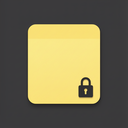

# SecretSticky

**Encrypted sticky notes for Windows** — the feel of Sticky Notes, with **secrets safe at rest**.

Use it for API keys, passwords, recovery codes, and anything you would not trust to plain Sticky Notes or a synced notepad.

[](https://github.com/AhmiDarrow/SecretSticky/actions/workflows/ci.yml)
[](LICENSE)
[](https://github.com/AhmiDarrow/SecretSticky/releases)

<p align="center">
  
</p>

<p align="center">
  <strong>Local-only · Master password · Multi-window stickies · System tray</strong>
</p>

---

## Why

Windows Sticky Notes is great for quick capture and terrible for secrets (plain local data, sync surface, no real vault). **SecretSticky** keeps the sticky UX and encrypts note titles and bodies on disk.

## Features (v0.1)

| Area | Details |
|------|---------|
| **Vault** | Master password unlock; optional recovery key (shown once at setup) |
| **Crypto** | Argon2id (64 MiB, t=3) + XChaCha20-Poly1305 AEAD |
| **Keys** | Stable content key — change password without re-encrypting notes or killing recovery |
| **Notes** | Multiple colored stickies (incl. black & dark green), always-on-top, high-contrast ink |
| **Tray** | New note · Show manager · Open all · Lock · Quit |
| **UX** | Close manager → tray; open a sticky → manager tucks away; Inter font (self-hosted) |
| **Windows** | Manager default **440×560**; sticky min **345×250** (new notes **345×280**) |
| **Clipboard** | Copy secrets with auto-clear (default 30s) |
| **Idle** | Auto-lock after inactivity (default 15 minutes) |
| **Updates** | Signed auto-update from GitHub Releases (About → Check for updates) |
| **About** | “Hi I'm Ahmi, hope this helps!” + profile / repo links |

## Install

### Prebuilt (recommended)

Download the latest Windows installer from  
**[Releases](https://github.com/AhmiDarrow/SecretSticky/releases/latest)**  
(NSIS `.exe` setup; MSI when available).

The NSIS installer creates **Start Menu** and **Desktop** shortcuts that use the sticky+lock icon (same mark as the taskbar and tray).

Installed builds can update themselves: **About → Check for updates** downloads the next signed release from GitHub and restarts the app.

### From source

```bash
git clone https://github.com/AhmiDarrow/SecretSticky.git
cd SecretSticky
npm install
npm run tauri:dev      # development
npm run tauri:build    # release installers under src-tauri/target/release/bundle/
```

**Requirements:** Windows 10/11, Node 20+, Rust stable, WebView2.

## Quick start

1. Launch SecretSticky → create a master password (8+ characters).
2. **Save the recovery key offline** (shown once). Lost password + lost recovery = permanent data loss.
3. Pick a color → sticky opens. Type secrets. Save indicator confirms disk write.
4. Close the manager with **X** → app stays in the tray. Tray → **Quit** to exit fully.
5. Tray → **Lock** when you step away.

## Data layout

```
%APPDATA%\SecretSticky\
  vault.json    # encrypted note blobs + KDF params (no plaintext titles/bodies)
```

- **Encrypted:** note title, note body  
- **Plaintext by design:** window geometry, color id, timestamps (so chrome can restore without unlock content)

Atomic replace on save (temp file + replace) so a crash mid-write is less likely to corrupt the vault.

## Security model

### Protects

- Vault file at rest (disk theft, backups, casual snooping)
- Authenticated encryption of note contents
- IPC least-privilege: a sticky window cannot list vault admin actions or read another note’s body

### Does **not** protect

- Malware / keyloggers while unlocked  
- Screen capture of open stickies  
- A compromised OS or attached debugger  

There is **no cloud**, **no account**, and **no backdoor**.

See [SECURITY.md](SECURITY.md) for reporting vulnerabilities.

## Development

```bash
npm install
npm run tauri:dev

# Tests
npm test              # TypeScript check + Vitest (UI helpers)
npm run test:rust     # Rust crypto / vault / ACL
npm run test:all      # both
npm run build         # Vite production bundle only
```

| Path | Role |
|------|------|
| `src/` | React UI (unlock, manager, sticky windows) |
| `src-tauri/src/crypto.rs` | KDF + AEAD |
| `src-tauri/src/vault.rs` | On-disk format + session |
| `src-tauri/src/commands.rs` | Tauri IPC, windows, tray |
| `.github/workflows/` | CI + tag release builds |

## CI & releases

- **CI** (`.github/workflows/ci.yml`) — on push/PR to `main`: frontend tests + Vite build, Rust fmt + tests (Windows).
- **Release** (`.github/workflows/release.yml`) — on tag `v*` (or manual dispatch): test gate, then signed Tauri NSIS/MSI + updater `latest.json`, draft GitHub Release.

```bash
# After bumping version in package.json, Cargo.toml, tauri.conf.json + CHANGELOG
git tag v0.1.2
git push origin v0.1.2
```

Requires repo secret `TAURI_SIGNING_PRIVATE_KEY` (see CONTRIBUTING).

## Stack

- **Tauri 2** + **React 19** + **TypeScript** + **Vite**
- **Rust:** `argon2`, `chacha20poly1305`, `zeroize`, `serde`
- **Updates:** `tauri-plugin-updater` + `tauri-plugin-process` (signed GitHub Releases)

## Auto-update

Release builds ship with the Tauri updater plugin:

1. CI signs NSIS/MSI updater artifacts with a minisign key (`TAURI_SIGNING_PRIVATE_KEY` repo secret).
2. Each release publishes `latest.json` next to the installers.
3. The app polls `…/releases/latest/download/latest.json`, verifies the signature with the **public** key embedded in the binary, then installs (About → Check for updates).

Dev (`tauri dev`) has no installer channel — use a packaged build to exercise updates.

## About

Hi I'm Ahmi, hope this helps!

- GitHub: [github.com/AhmiDarrow](https://github.com/AhmiDarrow)
- This project: [AhmiDarrow/SecretSticky](https://github.com/AhmiDarrow/SecretSticky)
- Releases: [github.com/AhmiDarrow/SecretSticky/releases](https://github.com/AhmiDarrow/SecretSticky/releases)

SecretSticky is a small, local-first Windows app for people who live in sticky notes but need real at-rest encryption for API keys and passwords. Built with Tauri so the UI stays light and the crypto stays in Rust.

## License

[MIT](LICENSE) © Ahmi Darrow

